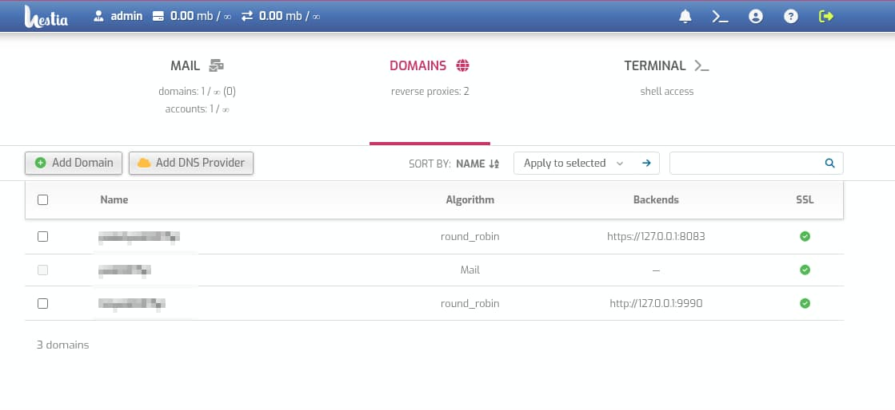

# Hestia-Mini

A lightweight, standalone admin panel derived from [HestiaCP](https://github.com/hestiacp/hestiacp),
supporting three focused feature areas: **Email**, **Domain Management**,
and **Terminal** — with a single `admin` user (no multi-user management).

Hestia-Mini keeps HestiaCP's battle-tested core — its CLI command surface, shell
function library, and the PHP web UI — while removing everything unrelated to
mail, domain management, and terminal: no web-hosting
(Apache/PHP-FPM vhosts), no database management, no DNS server, no FTP, no
file manager, no firewall rule management, no backups, no cron UI, and no app marketplace.

> **Attribution & License:** Hestia-Mini is derived from HestiaCP and is
> distributed under the GNU General Public License v3. See
> [`LICENSE`](LICENSE) and [`NOTICE.md`](NOTICE.md).

---

## Features

- **Email** — mail domains and accounts, aliases, auto-reply, forwarding,
  DKIM, antispam (SpamAssassin) and antivirus (ClamAV) toggles, quotas, and
  rate limits, backed by Exim + Dovecot.
- **Domain Management** — add, edit, list, and remove domains with Nginx
  reverse proxying and load balancing (round_robin, weighted, least_conn,
  ip_hash, hash). Supports multiple backend targets per domain and optional
  Let's Encrypt SSL.
- **Terminal** — web terminal (xterm.js over WebSocket) for the admin shell.
- **CLI-first** — a focused `v-*` command suite under `bin/` for scripting and
  automation, plus a JSON API.
- **Single admin** — one `admin` user with password/contact/language/theme
  settings and two-factor authentication. No user list, packages, roles,
  SSH/SFTP keys, notifications, or API-key management.

### Explicitly not included

Apache, PHP-FPM web-hosting pools, BIND/named (DNS server), MySQL/MariaDB,
PostgreSQL, iptables/fail2ban rule sets, FTP servers, file manager, vhost templates,
per-domain Let's Encrypt automation, cron UI, backup UI, and the quick-install
app marketplace.

---

## Resource usage

Idle footprint on a 6 GB test host (Exim + Dovecot + Nginx + panel PHP +
web terminal, ClamAV/SpamAssassin off): **~185 MB RSS** for the whole
Mini stack, **~440 MB** disk in `/usr/local/hestia`. Comfortable on a
1–2 GB VPS. Leaving ClamAV enabled adds roughly 200–500 MB on its own,
so use `--no-antivirus` on the smallest sizes.

---

## Requirements

- A dedicated **Debian 11/12/13** or **Ubuntu 22.04/24.04/26.04** server, **or** a
  server that already runs another control panel (e.g. 1Panel) that you don't
  want to conflict with.
- Root SSH access.
- A registered domain/hostname (required for correct SPF/DKIM/reverse-DNS mail
  deliverability).
- Outbound internet access during install.

Isolation from an existing panel is achieved through distinct ports and avoiding
services the other panel already owns — not containerization. See
[`docs/INSTALL.md`](docs/INSTALL.md#11-if-this-host-already-runs-another-panel-eg-1panel).

---

## Quick install

```bash
git clone <your-hestia-mini-repo-url> /usr/local/src/hestia-mini
cd /usr/local/src/hestia-mini
sudo bash install/hestia-mini-install.sh
```

*(Note: `install/minipanel-install.sh` is provided as a backward-compatible symlink)*

The installer is non-intrusive by default and creates the single `admin`
user. Common flags:

```
--yes, -y             Assume yes to all prompts (non-interactive)
--purge-mta           Purge a conflicting stub MTA on port 25
--no-purge-mta        Never purge, just warn
--no-antivirus        Skip installing ClamAV antivirus for mail
--no-antispam         Skip installing SpamAssassin antispam for mail
--admin-email EMAIL   Admin contact email
--admin-password PASS Admin password
```

Fully non-interactive example:

```bash
sudo bash install/hestia-mini-install.sh --yes --purge-mta \
  --admin-email you@yourdomain.com
```

After installing, **reboot once**, then follow the post-install checklist and
mail-deliverability DNS notes in [`docs/INSTALL.md`](docs/INSTALL.md).

---

## Uninstall

```bash
sudo bash install/hestia-mini-uninstall.sh --dry-run     # preview only
sudo bash install/hestia-mini-uninstall.sh               # interactive
sudo bash install/hestia-mini-uninstall.sh --yes         # full removal
sudo bash install/hestia-mini-uninstall.sh --yes --keep-data       # keep mail data
sudo bash install/hestia-mini-uninstall.sh --yes --keep-packages   # leave apt packages installed
```

*(Note: `install/minipanel-uninstall.sh` is provided as a backward-compatible symlink)*

Uninstall is destructive by default — always run `--dry-run` first.

---

> **NOTE — independent project, no upstream tracking:** Hestia-Mini is a
> standalone fork. It does not track HestiaCP releases. After installing,
> freeze the panel packages so no upstream upgrade can silently revert
> Mini's changes (deleted pages, single-user guard, trimmed API, and
> panel-specific fixes all live in `/usr/local/hestia`, which the upstream
> `hestia` package would overwrite):
>
> ```bash
> sudo apt-mark hold hestia hestia-nginx hestia-php hestia-web-terminal
> ```
>
> To fully detach, also remove the upstream apt source (`hestia.list` and
> its keyring) — mail-stack packages (Exim, Dovecot, Nginx, PHP) keep
> updating from Debian/Ubuntu/Sury normally. From that point on, this git
> repo is the sole source of updates: copy changed files over
> `/usr/local/hestia/` and restart `hestia` (+ `hestia-web-terminal` when
> its backend changed).

---

## Project structure

| Path | Purpose |
|---|---|
| `bin/` | CLI commands (`v-add-*`, `v-change-*`, `v-delete-*`, `v-list-*`, `v-suspend-*`, …) |
| `func/` | Shell function library (`main.sh`, `domain.sh`, `domain_proxy.sh`, `ip.sh`, `rebuild.sh`, `syshealth.sh`, `upgrade.sh`) |
| `src/` | Backend source files (e.g. `deb/web-terminal/` — Node.js WebSocket-to-PTY bridge) |
| `web/` | Panel web UI (PHP) — `inc/` core, `add/`, `edit/`, `delete/`, `list/`, `login/`, `api/`, `src/`, themes, locale |
| `web/css/src/`, `web/js/src/` | Front-end sources compiled into `web/css/themes/*.min.css` and `web/js/dist/*` |
| `build.js`, `package.json` | Front-end asset build (esbuild + Lightning CSS) |
| `install/` | Installer (`hestia-mini-install.sh`), uninstaller (`hestia-mini-uninstall.sh`), and packaged config templates |
| `conf/` | Default panel configuration (`hestia.conf`, with `minipanel.conf` kept as a compatibility symlink) |
| `data/` | Runtime data (`users/`, `packages/`, `queue/`) |
| `docs/` | Documentation |

---

## Front-end build

`web/css/src/**` (styles) and `web/js/src/**` (scripts) are the panel's real
front-end sources. They are compiled into `web/css/themes/*.min.css` and
`web/js/dist/*`:

```bash
npm install
npm run build
```

The installer runs this automatically, so a fresh install always deploys
Hestia-Mini's own UI (the upstream `hestia` package only ships upstream's
prebuilt bundles). After changing anything under `web/css/src` or
`web/js/src`, re-run `npm run build` and redeploy the built files.

---

## Documentation

- [`docs/INSTALL.md`](docs/INSTALL.md) — full install, deploy, and uninstall
  guide, including post-install checklist, firewall/ports reference, and mail
  deliverability (SPF/DKIM/DMARC/PTR) notes.

## License

Hestia-Mini is distributed under the [GNU General Public License v3](LICENSE).
This project is derived from [HestiaCP](https://github.com/hestiacp/hestiacp);
see [`NOTICE.md`](NOTICE.md) for attribution.
